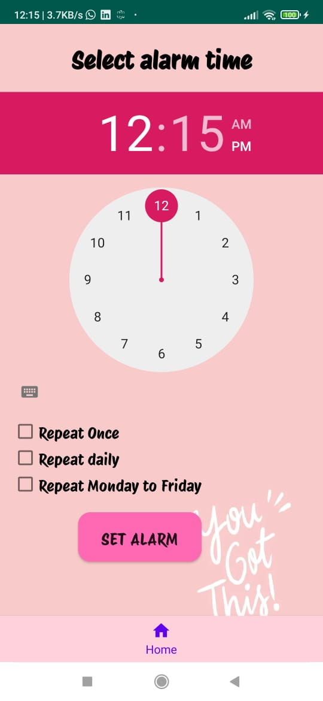

# Smart Clock 


<p>The clock powered by ESP32 microcontroller, integrated with Firebase, and controlled by the Alarm Bee App. The clock displays the daily remainders and ringing alarms that user setted trought the App.</p>

## Features
- Automatic time and date adjustment based on GMT.
- Remote access and control via the Alarm Bee App.
- Touch buttons for stopping alarms and displaying daily reminders.
- Rechargeable battery powered.

## Getting Started 
check out the user manual 
<br />
<br />


# Alarm-Bee-App
Alarm Bee App is an Android application developed using Android Studio, Java. It serves as a comprehensive alarm and reminder tool, integrated with Firebase Realtime Database for seamless data synchronization across devices. Users can set alarms, create reminders, manage their schedule, and securely access their data through user authentication.

## Features
1. **QR Code Scanning**:
   - Use QR code scanning to establish a personalized user space in Firebase, ensuring secure data access.
   - Simplify the login process and enhance data privacy using QR code authentication.

2. **Alarm Management**:
   - Users can set multiple alarms for different times and days.
     
3. **Reminder Creation**:
   - Users can create reminders for important tasks or events.
   - Option to set reminders with specific dates, times, and recurrence patterns.
  
4. **Firebase Integration**:
   - Utilize Firebase Realtime Database for storing and syncing alarm and reminder data across devices.
   - Ensure seamless access to alarms and reminders from multiple devices in real-time.


## Getting Started

To get started with the Alarm Bee App, follow these steps:

1. **Create an Account**:
   - Open the app and create a new account by providing your username.
        <br />
         <br />
        &nbsp;&nbsp;&nbsp;
  
     

2. **Scan QR Code**:
   - After creating your account, scan the provided QR code to establish your personalized user space in Firebase. This step ensures secure data access and enhances data privacy.
   - After scanning, App navigate to Home page
       <br />
        <br />
       &nbsp;&nbsp;&nbsp;

3. **Set Alarms**:
   - After adding reminders, proceed to set alarms for specific times and days. Navigate to the alarms section in the app and click on the "Set Alarm" button to create a new alarm.
        <br />
         <br />
        &nbsp;&nbsp;&nbsp;

4. **Add Reminders**:
   - Once your account is set up, you can start adding reminders for important tasks or events. Navigate to the reminders section in the app and click on the "Add Reminder" button to create a new reminder.
        <br />
         <br />
        

## Installation

To run the Alarm Bee App on your local machine, follow these steps:

1. **Clone the repository**:
   ```bash
   git clone https://github.com/SaumyaAbeysekara/Alarm-Bee.git
2. **Open the project in Android Studio**
3. **Set up Firebase**
   - Create a Firebase project in the Firebase console.
   - Add your Firebase configuration file (google-services.json) to the app directory.
4. **Run the app on an Android device or emulator**
   
# Contact 
For inquiries or support, please contact [saumyaabeysekara@gmail.com](mailto:your@email.com).
