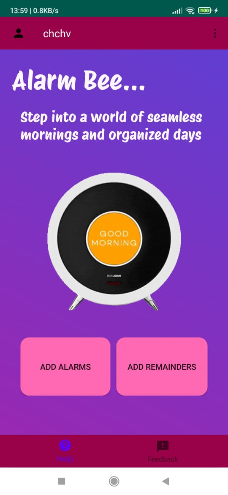

# Alarm-Bee-App
Alarm Bee App is an Android application developed using Android Studio, Java. It serves as a comprehensive alarm and reminder tool, integrated with Firebase Realtime Database for seamless data synchronization across devices. Users can set alarms, create reminders, manage their schedule, and securely access their data through user authentication.

## Features
1. **QR Code Scanning**:
   - Use QR code scanning to establish a personalized user space in Firebase, ensuring secure data access.
   - Simplify the login process and enhance data privacy using QR code authentication.

2. **Alarm Management**:
   - Users can set multiple alarms for different times and days.
     
3. **Reminder Creation**:
   - Users can create reminders for important tasks or events.
   - Option to set reminders with specific dates, times, and recurrence patterns.
  
4. **Firebase Integration**:
   - Utilize Firebase Realtime Database for storing and syncing alarm and reminder data across devices.
   - Ensure seamless access to alarms and reminders from multiple devices in real-time.

